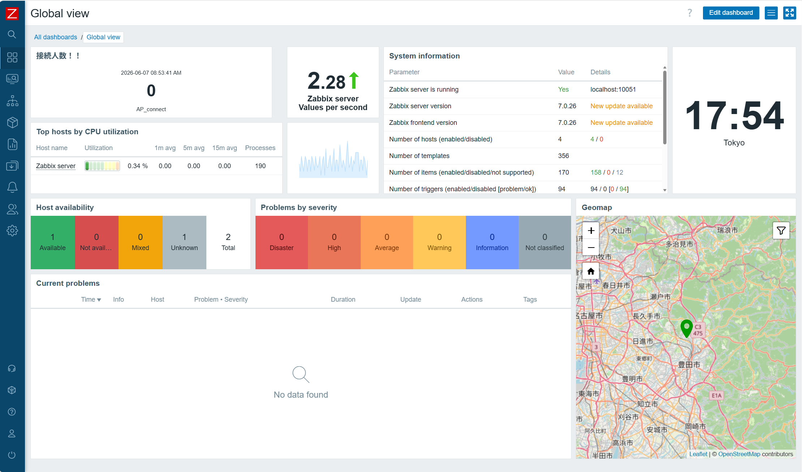

# 文化祭 NOCプロジェクト: Zabbix 7.0 LTS 監視サーバー構築

文化祭でフリーWi-Fiを提供する企画のため、当日運用するネットワーク（Wi-Fi・各種サーバー）を一元管理するネットワークオペレーションセンター（NOC）の監視基盤を、仮想化環境上に構築しました。
## 以下は本番に向けての試験の記録

## 構築環境
* **Hypervisor:** Proxmox VE
* **OS:** Ubuntu 24.04 LTS 
* **Monitoring Platform:** Zabbix 7.0 LTS 
* **Database:** MariaDB 10.11

---

## 構築手順

実行コードの詳細は、本リポジトリ内の `setup.sh` を参照してください。

---

## 構築中に直面したトラブルと解決プロセス
実際のプロダクション環境と同様に発生したインフラトラブルに対し、ログの監視と仮説検証を基に以下の通り解決しました。

### 1. ディスク容量不足によるフリーズ
* **事象:** 初期割り当て容量（2.4GB）が100%になり、OSおよびパッケージ展開が完全停止。
* **原因:** OSのログおよびZabbixのファイル展開によるバースト。
* **対策:** `/tmp` 領域を一時的にメモリ上に逃がしてコマンド受付を回復させた後、Proxmox側でストレージを 22GB へ拡張。Linuxのパーティション（LVM/ext4）をリサイズし、データを保持したまま復旧。

### 2. パッケージの不完全インストールの特定
* **事象:** 容量復旧後、設定書き込みコマンド（`sed`）が `No such file or directory` でエラー終了。
* **原因:** 1の容量不足時に、Zabbixサーバーのコアパッケージ（`zabbix_server.conf` 等）の解凍が途中で強制終了していた。
* **対策:** `find` コマンドで設定ファイルの存在を検索し、未インストール状態を特定。`apt-get install` を再実行して依存関係を正常に修復。

### 3. CUIの改行バグによるSQLインポート失敗
* **事象:** データベースへの初期データ（数万行のスキーマ）流し込み（`zcat`）がエラー終了。
* **原因:** ターミナルへの一括貼り付け時、改行コードのズレによりコマンドが途中で誤認識された。
* **対策:** ファイルの絶対パスを確認し、対話型ではなく単発のインポートコマンドとして正確に再実行し完了。

---

##  セキュリティ対策：ローカル環境のHTTPS化
初期状態のHTTP通信では、文化祭の来場者にネットワーク上で管理用パスワードを盗聴されるリスクがありました。
本環境は校内LANの閉じられた空間であるため、外部の認証機関ではなく、**OpenSSLを用いた自己署名証明書**を自作。Apacheの仮想ホスト設定（`default-ssl.conf`）を書き換え、Zabbix管理画面への通信を暗号化（HTTPS）しました。

---

##  応用実装：ヤマハAPからのWi-Fi接続人数を把握する仕組み
ネットワークの混雑状況を可視化するため、サークル内に設置されたヤマハ製アクセスポイント（WLXシリーズ）からリアルタイムの接続人数を取得する仕組みを独自に実装しました。

### 4. SNMPの壁と、HTTPルートによる執念のデータ抽出
* **事象:** 機器の制限により標準的なSNMPでのデータ取得が困難だった。
* **原因:** 該当APの仕様、およびクライアント特定に関わるセキュリティの兼ね合い。
* **対策:** Zabbixの **HTTPエージェント** 機能を使い、APのWeb管理画面へ直接認証をかけてHTMLを丸ごとデータとして取得。

### 5. JavaScript（保存前処理）によるHTMLのパースと整数化
* **事象:** Web画面のHTMLから「接続人数」の数字だけを綺麗に抽出する必要があった。また、初期状態ではZabbix側で小数が付くため視認性が悪かった。
* **対策:** ZabbixのプレプロセッシングにてJavaScriptを記述。
  2.4GHz帯、5GHz帯の各HTML要素から正規表現を用いて接続人数を抽出し、それらを足し算するロジックを実装。さらにダッシュボードの「小数点 (Decimals)」設定を `0` にチューニングすることで、完全な整数としてリアルタイムに自動更新されるグラフ・数値を完成。

### 6. ネットワーク制限（締め出しリスク）の回避
* **事象:** APのアクセス制限（ホワイトリスト方式）を有効化する際、設定を誤ると管理PCごと締め出され、APが物理初期化を余儀なくされるリスクがあった。
* **対策:** 現行のネットワーク（`192.168.10.0/24`）と、Zabbixサーバーのいるネットワークの両方を包含する `192.168.0.0/16` などの適切なCIDR範囲（または複数行登録）を設計し適用。締め出しを完全に回避しつつ、Zabbixからの通信のみを許可する安全なアクセス制御を確立。

### 7. トリガーによる自動検知
* **実装:** 接続人数が0人より多くなった場合（誰かがWi-Fiに接続した瞬間）を検知するトリガー（`last() > 0`）を構築。ダッシュボード上に「障害（イベント）」としてリアルタイムにアラートが上がる仕組みまでを統合。

##  構築完了ステータス

無事にすべてのバックエンドサービスが正常起動し、日本の標準時に同期された監視ダッシュボードが立ち上がりました。

### ダッシュボード画面（グローバルビュー）

- Zabbixサーバー：**稼働中**
- フロントエンドバージョン：**7.0.26 **

---

## 今後の展望

当日に使うAPにSNMP設定
